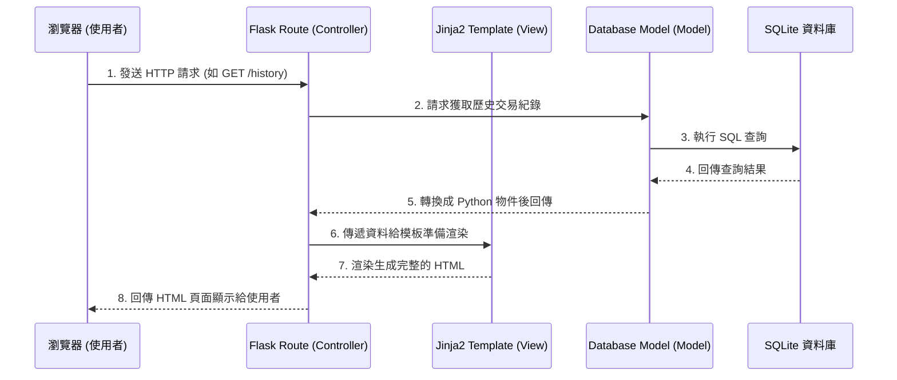

# 系統架構文件 (Architecture Document)

此文件根據 `docs/PRD.md` 的需求，規劃了個人記帳簿系統的系統架構與專案結構。

## 1. 技術架構說明

本系統採用經典的 **MVC (Model-View-Controller)** 架構模式，確保前端呈現與後端邏輯分離，易於維護與後續擴充。

### 選用技術與原因
- **後端框架：Python + Flask**
  - 原因：輕量且彈性高，適合快速開發中小型網頁應用或 MVP，且學習曲線平緩。
- **模板引擎：Jinja2**
  - 原因：Flask 內建支援的模板引擎，能將 Python 變數動態渲染至 HTML 頁面中，適合不使用前後端分離的單體架構。
- **資料庫：SQLite (透過 SQLAlchemy ORM 或直接 sqlite3)**
  - 原因：個人記帳系統資料量不大且以單機或本地化為主，不需額外架設資料庫伺服器（如 MySQL/PostgreSQL），SQLite 作為檔案型資料庫方便攜帶與備份。

### Flask MVC 模式說明
- **Model (模型)**：負責與 SQLite 資料庫溝通，定義「收入」與「支出」的資料表結構並處理資料的增刪查改 (CRUD)。
- **View (視圖)**：負責呈現使用者介面。在這裡指的是 Jinja2 和 HTML 檔案，包含表單、表格與圖表以展示從 Controller 取得的資訊。
- **Controller (控制器)**：在 Flask 中由 `routes` 處理。負責接收使用者的網頁請求（如新增收支、查詢歷史），向 Model 呼叫與更新資料，最後將結果回傳給 View 渲染結果。

## 2. 專案資料夾結構

為了讓專案能夠結構化，並易於開發管理，以下是推薦的專案目錄結構：

```text
web_app_development/
├── app.py                 # 應用程式入口檔案 (啟動 Server, 註冊 Blueprint 等)
├── config.py              # 系統設定檔（資料庫路徑、Secret Key 等參數）
├── requirements.txt       # Python 相依套件清單（如 Flask, SQLAlchemy）
├── docs/                  # 文件目錄
│   ├── PRD.md             # 產品需求文件
│   └── ARCHITECTURE.md    # 系統架構文件（本文檔）
├── app/                   # 主應用程式邏輯區
│   ├── __init__.py        # 應用程式工廠模式或初始化 Flask App
│   ├── models/            # 資料庫模型區 (Models)
│   │   ├── __init__.py
│   │   └── transaction.py # 定義交易 (收付款) 的資料結構與操作
│   ├── routes/            # 路由控制器區 (Controllers)
│   │   ├── __init__.py
│   │   ├── main.py        # 處理首頁與餘額顯示
│   │   ├── income.py      # 處理新增與修改收入
│   │   ├── expense.py     # 處理新增與修改支出
│   │   └── report.py      # 處理顯示統計與歷史紀錄
│   ├── templates/         # 網頁模板區 (Views)
│   │   ├── base.html      # 基礎排版模板 (Header/Footer)
│   │   ├── index.html     # 首頁模板（顯示當前餘額）
│   │   ├── history.html   # 歷史紀錄列表模板
│   │   └── statistics.html# 分類統計圖表模板
│   └── static/            # 靜態資源區
│       ├── css/
│       │   └── style.css  # 自訂樣式表
│       └── js/
│           └── script.js  # 自訂前端互動邏輯 (如有需要)
└── instance/              # 執行實例專門存放區 (不上傳到版控)
    └── database.db        # SQLite 實體資料庫檔案
```

## 3. 元件關係圖

以下展示使用者從瀏覽器發出請求，經由 Flask 到達資料庫並回傳頁面的流程：



## 4. 關鍵設計決策

1. **單體應用架構 (Monolithic Architecture) 搭配伺服器渲染 (SSR)**
   - **原因**：為了最快速達成 MVP 目標且專注在核心邏輯體驗上，不引入複雜的前後端分離框架（如 React/Vue）。使用 Flask 搭配 Jinja2 可以很快生成動態網頁內容，降低初期開發的門檻。
   
2. **採用 SQLite 搭配 Blueprint (藍圖) 切分路由**
   - **原因**：雖然是小型專案，但考量未來可能需要獨立管理「收入」、「支出」、「統計」，因此一開始就建議在 `routes/` 個別宣告路由以保持 `app.py` 乾淨；搭配能不須架設即可執行的 SQLite 非常適合本地端的輕量級記帳系統。

3. **統一的 Model 定義 (Transaction 表格合併設計)**
   - **原因**：本系統的「收入」與「支出」屬性非常接近。設計上可以使用同一張名為 `Transaction` (交易) 的資料表，並用一個欄位 (`type`: income 或 expense) 進行區分。這樣便於計算「總餘額」以及歷史清單的時間排序。

4. **敏感憑證與資料庫位置隔離 (Instance Folder)**
   - **原因**：為了保護資料庫，我們將 SQLite 設置於 `instance/` 資料夾之中，並在 Git 設定中略過這個資料夾。這有助於在推上 GitHub 等遠端時避免洩漏個人的真實記帳資料。
