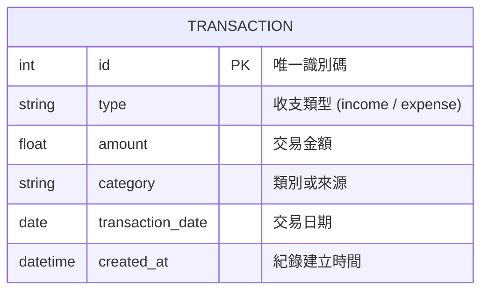

# 資料庫設計文件 (DB Design)

本文件依據流程與需求，定義「個人記帳簿系統」的 SQLite 資料庫結構。

## 1. ER 圖（實體關係圖）

在此專案中，我們將所有支出與收入項目統一儲存在單一的 `transactions` 資料表中，因為兩者的結構極度相似，僅類型 (Type) 與分類名稱有別。

## 2. 資料表詳細說明

### `transactions` (交易紀錄表)

這個資料表紀錄了所有使用者的收入與支出明細。

| 欄位名稱 | 類型 | 必填 | 說明 |
| --- | --- | --- | --- |
| `id` | INTEGER | 是 | Primary Key, 自動遞增的唯一識別碼 |
| `type` | TEXT | 是 | 收支類型，僅允許 `'income'` (收入) 或 `'expense'` (支出) |
| `amount` | REAL | 是 | 交易金額 (可支援小數或純整數) |
| `category` | TEXT | 是 | 分類標籤 (例如：食、衣、住、行為支出；薪水、獎金為收入) |
| `transaction_date` | TEXT | 是 | 發生交易的日期，採用 ISO 8601 格式 (YYYY-MM-DD) |
| `created_at` | DATETIME | 是 | 系統自動寫入的紀錄建立時間戳記 (預設 CURRENT_TIMESTAMP) |

## 3. SQL 建表語法

請參考 `database/schema.sql` 中的完整建立語法。

## 4. Python Model 程式碼

我們選用 Python 內建的 `sqlite3` 模組提供原始的 CRUD 操作。相關模型實作與操作方法已於 `app/models/transaction.py` 中建立。包含常用的增刪改查：
- `create`
- `get_all`
- `get_by_id`
- `update`
- `delete`
