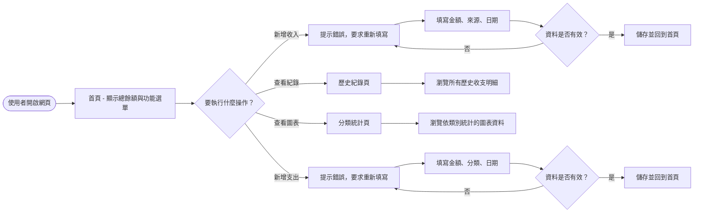
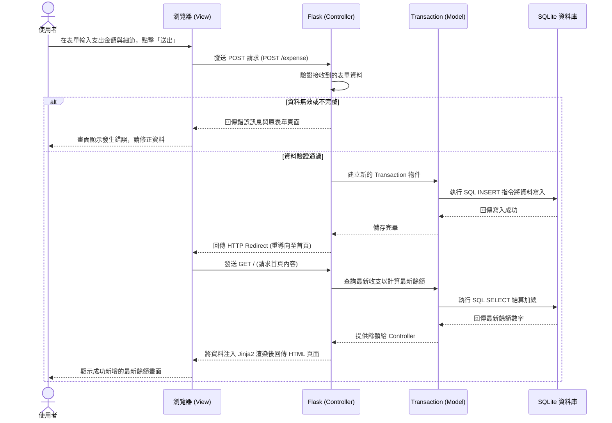

# 流程圖文件 (Flowchart)

此文件根據 `docs/PRD.md` 的需求與 `docs/ARCHITECTURE.md` 的架構設計，繪製出個人記帳簿系統的使用者流程與系統序列流程。

## 1. 使用者流程圖 (User Flow)

此流程圖描述使用者從進入網站開始，在網頁上的所有操作路徑與可能的分支情境。

## 2. 系統序列圖 (Sequence Diagram)

此序列圖描述「使用者新增一筆收支紀錄」時的背後技術運作流程，涵蓋瀏覽器、Flask 後端與資料庫。以「新增支出」為例：

## 3. 功能清單對照表

依照前面設計的規劃，以下列出本系統所有的核心功能、對應的 HTTP 方法與預期的 URL 路由設計。

| 主要功能 | 說明 | HTTP 動作 | 預期 URL 路徑 |
| --- | --- | --- | --- |
| **首頁與餘額** | 系統首頁，包含導覽列與目前加總的總餘額 | GET | `/` |
| **新增收入頁面** | 呈現新增收入的 HTML 表單給使用者填寫 | GET | `/income` |
| **送出收入資料** | 接收表單提交的收入資料，處理寫入動作 | POST | `/income` |
| **新增支出頁面** | 呈現新增支出的 HTML 表單給使用者填寫 | GET | `/expense` |
| **送出支出資料** | 接收表單提交的支出資料，處理寫入動作 | POST | `/expense` |
| **歷史紀錄查詢** | 列出所有歷史以來的收支明細清單 | GET | `/history` |
| **分類統計結果** | 顯示各個支出類別的統計結果（如：圓餅圖） | GET | `/statistics` |
